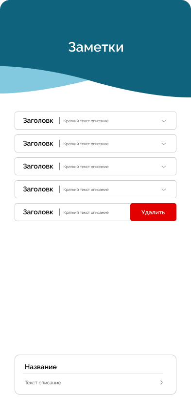
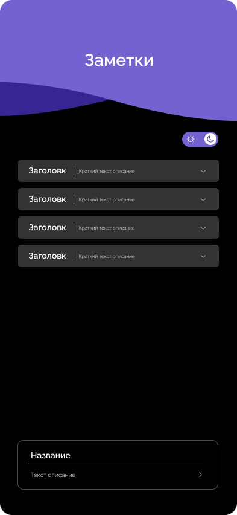

<h2>"Заметки с комментариями" на React-Native (iOS, Android)</h2>

<h3>
  Реализован экран с возможность добавлять и удалять заметку. Заметка в виде
  выпадающего списка с параметрам: название, краткое описание, полное описание и
  дата. Добавление заметки происходит через текстовые поля, в поле «Название»
  вводиться заголовок - до 25 символов. В нижнее поле «текст описание» вводиться
  содержание заметки, дата берется текущая. При выводе заметки, первым выводится
  название, потом первые 20 символов заметки. При раскрытии заметки выводиться
  полное описание и дата. Удаление заметки происходит свайпом влево, возле блока
  с заметкой появляется кнопка «Удалить», при нажатии на кнопку появляется
  кнопка с обратным отсчетом внутри (5 секунд), если до момента истечения
  отсчета нажать на кнопку, то удаление заметки отменяется, в обратном случае
  заметка удаляется.
</h3>

  
  
  
  

<h3>
  Внутри заметки хранятся комментарии и есть возможность их добавления.
  Комментарий содержит в себе: название, текст комментария и время/дату, в
  которое этот комментарий отправили. Реализована возможность ответа на
  комментарии. При клике на ссылку «Ответить» возле текстового поля появляется
  текст «Ответ на комментарий - {название комментария}». По умолчанию
  показывается только один ответ на комментарий, при клике на «показать все
  ответы» появляются все ответы.
</h3>

  
  

<h3>Реализована смена тем по нажатию переключателя.</h3>

  
  
  

<h3>Реализована фильтрация заметок по выбранному периоду времени.</h3>

  

<h3>При разработке использовались дополнительные библиотеки:</h3>
<ul>
  <li>react-native-swiper</li>
  <li>react-native-switch</li>
  <li>@react-native-community/datetimepicker</li>
  <li>react-native-vector-icons</li>
</ul>
